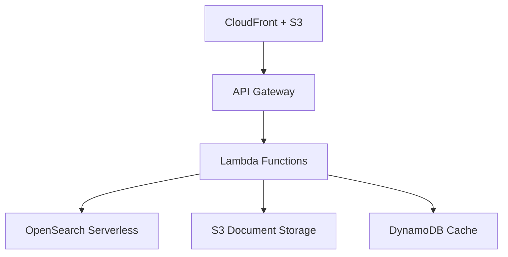

# 🚀 AWS Deployment Roadmap & Cost-Optimized Strategy
*Quest Analytics RAG Assistant - Student-Friendly Cloud Deployment Plan*

---

## 📋 Executive Summary

This comprehensive plan outlines a **cost-conscious AWS deployment strategy** for the Quest Analytics RAG Assistant, specifically designed for **master students transitioning to full-time roles**. The approach emphasizes:

- **💰 Cost optimization** through serverless-first architecture
- **📈 Gradual scaling** from MVP to production-ready system
- **🛡️ Essential security** without enterprise overhead
- **⚡ Quick deployment** to demonstrate capabilities to potential employers

---

## 💸 Cost-Optimized Architecture Options

### **Option A: Serverless-First (Recommended for Students)**
**Estimated Monthly Cost: $15-50**



**Components:**
- **Frontend:** S3 + CloudFront ($1-5/month)
- **API Layer:** API Gateway + Lambda ($5-15/month)
- **Search:** OpenSearch Serverless ($10-25/month)
- **LLM:** AWS Bedrock Claude/Titan ($2-10/month)
- **Storage:** S3 + DynamoDB ($1-5/month)

**Pros:** Pay-per-use, automatic scaling, minimal management
**Cons:** Cold start latency, vendor lock-in

### **Option B: Containerized Minimal (Alternative)**
**Estimated Monthly Cost: $25-75**

- **ECS Fargate Spot:** t4g.medium equivalent ($15-30/month)
- **OpenSearch t3.small.search:** ($25-35/month)
- **ALB + CloudWatch:** ($5-10/month)

**Pros:** More control, easier migration from Docker Compose
**Cons:** Higher baseline cost, requires management

### **Option C: Hybrid Approach (Growth Path)**
**Estimated Monthly Cost: $20-60**

- **Static assets:** S3 + CloudFront
- **API:** Lambda for light workloads, Fargate for heavy processing
- **Search:** OpenSearch Serverless with intelligent caching
- **LLM:** Bedrock with S3/DynamoDB response caching

---

## 🎯 Three-Phase Deployment Strategy

### **Phase 1: MVP Deployment (Weeks 1-2)**
*Goal: Get a working demo online quickly for job interviews*

**Deliverables:**
- [ ] Basic serverless RAG API via Lambda + Bedrock
- [ ] Simple web interface via S3 + CloudFront
- [ ] Document upload to S3 with Lambda processing
- [ ] OpenSearch Serverless for vector storage

**AWS Services:**
```yaml
Core Services:
  - Lambda (Python runtime)
  - S3 (document storage + web hosting)
  - CloudFront (global CDN)
  - API Gateway (REST API)
  - OpenSearch Serverless
  - Bedrock (Claude or Titan models)

Supporting:
  - IAM roles and policies
  - CloudWatch basic logging
  - Route 53 (if custom domain desired)
```

**Estimated Cost:** $15-30/month

### **Phase 2: Production-Ready (Weeks 3-4)**
*Goal: Add reliability, monitoring, and professional features*

**Deliverables:**
- [ ] Response caching via DynamoDB
- [ ] Comprehensive monitoring dashboard
- [ ] Error handling and graceful degradation
- [ ] CI/CD pipeline via GitHub Actions
- [ ] HTTPS with custom domain

**Additional Services:**
```yaml
Enhancements:
  - DynamoDB (response cache)
  - CloudWatch dashboards + alarms
  - AWS Certificate Manager (SSL)
  - Systems Manager (secrets)
  - CloudFormation (IaC)
```

**Estimated Cost:** $25-45/month

### **Phase 3: Enterprise Features (Month 2)**
*Goal: Demonstrate scalability and advanced capabilities*

**Deliverables:**
- [ ] Multi-model routing (small/large models)
- [ ] Advanced security (WAF, VPC)
- [ ] Data backup and disaster recovery
- [ ] Performance optimization
- [ ] Cost allocation and budgets

**Advanced Services:**
```yaml
Enterprise:
  - AWS WAF (security)
  - VPC (network isolation)
  - ECS/Fargate (if hybrid approach)
  - S3 Glacier (archival)
  - AWS Budgets (cost control)
```

**Estimated Cost:** $40-80/month

---

## 🏗️ Serverless Architecture Deep Dive

### **Lambda Function Design**

```python
# Lambda function structure for cost optimization
import json
import boto3
from functools import lru_cache

@lru_cache(maxsize=128)
def get_cached_response(query_hash):
    """In-memory caching for Lambda warm starts"""
    pass

def lambda_handler(event, context):
    """
    Main RAG Lambda function with cost optimizations:
    - Reuse connections across invocations
    - Cache embeddings and responses
    - Batch processing when possible
    """
    
    # Connection pooling for performance
    opensearch_client = get_opensearch_client()
    bedrock_client = get_bedrock_client()
    
    # Process based on event type
    if event.get('source') == 'api-gateway':
        return handle_query_request(event, opensearch_client, bedrock_client)
    elif event.get('source') == 's3':
        return handle_document_ingestion(event, opensearch_client)
```

### **Cost Optimization Strategies**

1. **Smart Caching Architecture:**
   ```yaml
   Cache Layers:
     - Lambda Memory: 1-15 minutes (free)
     - DynamoDB: 1-24 hours ($0.25/GB/month)
     - S3: Long-term responses ($0.023/GB/month)
   ```

2. **Bedrock Model Selection:**
   ```yaml
   Model Routing:
     - Simple queries: Claude 3 Haiku ($0.25/1M tokens)
     - Complex queries: Claude 3.5 Sonnet ($3/1M tokens)
     - Bulk processing: Titan Text Express ($0.13/1M tokens)
   ```

3. **OpenSearch Serverless Optimization:**
   ```yaml
   Configuration:
     - Compute: On-demand (auto-scaling)
     - Storage: Only pay for indexed data
     - Networking: VPC endpoints (avoid NAT gateway costs)
   ```

---

## 🛠️ Implementation Timeline

### **Week 1: Foundation Setup**
```bash
Days 1-2: AWS Account & IAM Setup
- Create AWS account with student credits
- Set up IAM user with minimal permissions
- Configure AWS CLI and credentials

Days 3-4: Core Infrastructure
- Deploy OpenSearch Serverless domain
- Set up S3 buckets (docs + web hosting)
- Create Lambda function skeleton

Days 5-7: Basic RAG Pipeline
- Implement document ingestion Lambda
- Build query processing Lambda
- Test with sample documents
```

### **Week 2: Web Interface & Integration**
```bash
Days 8-10: Frontend Development
- Adapt Gradio app for S3 static hosting
- Create API Gateway endpoints
- Implement file upload workflow

Days 11-14: Testing & Optimization
- End-to-end testing
- Performance tuning
- Cost monitoring setup
```

### **Weeks 3-4: Production Hardening**
```bash
Week 3: Reliability & Monitoring
- CloudWatch dashboards
- Error handling and retries
- Caching implementation

Week 4: Security & CI/CD
- HTTPS setup with custom domain
- GitHub Actions deployment pipeline
- Security scanning and hardening
```

---

## 🔧 Deployment Automation

### **GitHub Actions Workflow**
```yaml
# .github/workflows/deploy.yml
name: Deploy RAG Assistant

on:
  push:
    branches: [main]

env:
  AWS_REGION: us-east-1

jobs:
  deploy:
    runs-on: ubuntu-latest
    steps:
      - uses: actions/checkout@v4
      
      - name: Configure AWS credentials
        uses: aws-actions/configure-aws-credentials@v4
        with:
          aws-access-key-id: ${{ secrets.AWS_ACCESS_KEY_ID }}
          aws-secret-access-key: ${{ secrets.AWS_SECRET_ACCESS_KEY }}
          aws-region: ${{ env.AWS_REGION }}
      
      - name: Deploy Lambda functions
        run: |
          pip install -r requirements.txt -t ./lambda-package/
          cd lambda-package && zip -r ../lambda-deployment.zip .
          aws lambda update-function-code \
            --function-name rag-query-processor \
            --zip-file fileb://../lambda-deployment.zip
      
      - name: Update S3 static site
        run: |
          aws s3 sync ./static-web/ s3://${{ vars.S3_BUCKET_NAME }}/
          aws cloudfront create-invalidation \
            --distribution-id ${{ vars.CLOUDFRONT_DISTRIBUTION_ID }} \
            --paths "/*"
```

### **CloudFormation Template**
```yaml
# infrastructure/main.yml
AWSTemplateFormatVersion: '2010-09-09'
Description: 'Cost-optimized RAG Assistant for Students'

Parameters:
  Environment:
    Type: String
    Default: 'dev'
    AllowedValues: ['dev', 'staging', 'prod']

Resources:
  # S3 Buckets
  DocumentStorageBucket:
    Type: AWS::S3::Bucket
    Properties:
      BucketName: !Sub '${AWS::StackName}-documents-${Environment}'
      LifecycleConfiguration:
        Rules:
          - Status: Enabled
            Transitions:
              - TransitionInDays: 30
                StorageClass: STANDARD_IA
              - TransitionInDays: 90
                StorageClass: GLACIER
  
  # Lambda Functions
  QueryProcessorFunction:
    Type: AWS::Lambda::Function
    Properties:
      FunctionName: !Sub '${AWS::StackName}-query-processor'
      Runtime: python3.11
      Handler: lambda_function.lambda_handler
      MemorySize: 1024
      Timeout: 300
      Environment:
        Variables:
          OPENSEARCH_ENDPOINT: !GetAtt OpenSearchDomain.DomainEndpoint
          CACHE_TABLE_NAME: !Ref CacheTable
  
  # OpenSearch Serverless
  OpenSearchCollection:
    Type: AWS::OpenSearchServerless::Collection
    Properties:
      Name: !Sub '${AWS::StackName}-collection'
      Type: SEARCH
```

---

## 📊 Cost Monitoring & Control

### **AWS Budgets Configuration**
```json
{
  "BudgetName": "RAG-Assistant-Student-Budget",
  "BudgetLimit": {
    "Amount": "50.00",
    "Unit": "USD"
  },
  "TimeUnit": "MONTHLY",
  "CostFilters": {
    "Service": [
      "Amazon OpenSearch Service",
      "AWS Lambda",
      "Amazon S3",
      "Amazon Bedrock"
    ]
  },
  "Notifications": [
    {
      "NotificationType": "ACTUAL",
      "ComparisonOperator": "GREATER_THAN",
      "Threshold": 80,
      "ThresholdType": "PERCENTAGE",
      "NotificationState": "ALARM"
    }
  ]
}
```

### **Cost Optimization Monitoring**
```python
# scripts/cost_monitor.py
import boto3
import json
from datetime import datetime, timedelta

def get_daily_costs():
    """Monitor daily AWS costs for budget awareness"""
    client = boto3.client('ce')  # Cost Explorer
    
    end_date = datetime.now()
    start_date = end_date - timedelta(days=7)
    
    response = client.get_cost_and_usage(
        TimePeriod={
            'Start': start_date.strftime('%Y-%m-%d'),
            'End': end_date.strftime('%Y-%m-%d')
        },
        Granularity='DAILY',
        Metrics=['BlendedCost'],
        GroupBy=[
            {
                'Type': 'DIMENSION',
                'Key': 'SERVICE'
            }
        ]
    )
    
    return response

def optimize_unused_resources():
    """Identify and suggest cleanup of unused resources"""
    # Check for unused Lambda functions, S3 buckets, etc.
    pass
```

---

## 🚢 Quick Start Deployment Guide

### **Prerequisites**
```bash
# 1. Install required tools
pip install awscli boto3 cloudformation-cli-python-plugin
npm install -g aws-cdk

# 2. Configure AWS credentials with student account
aws configure
# Access Key ID: [Your student account key]
# Secret Access Key: [Your student account secret]
# Region: us-east-1 (cheapest for most services)

# 3. Enable required services
aws bedrock list-foundation-models --region us-east-1
aws opensearchserverless list-collections
```

### **One-Click Deployment**
```bash
# Clone and deploy
git clone <your-repo>
cd AI_RAG
./scripts/deploy-student-stack.sh

# This script will:
# 1. Create CloudFormation stack
# 2. Deploy Lambda functions
# 3. Upload web assets to S3
# 4. Configure API Gateway
# 5. Set up monitoring
```

### **Deployment Script**
```bash
#!/bin/bash
# scripts/deploy-student-stack.sh

set -e

STACK_NAME="rag-assistant-student"
REGION="us-east-1"

echo "🚀 Deploying RAG Assistant (Student-Optimized)..."

# 1. Create infrastructure stack
aws cloudformation deploy \
  --template-file infrastructure/student-stack.yml \
  --stack-name $STACK_NAME \
  --capabilities CAPABILITY_IAM \
  --region $REGION \
  --parameter-overrides \
    Environment=dev \
    BudgetLimit=50

# 2. Package and deploy Lambda functions
cd lambda-functions
pip install -r requirements.txt -t ./package/
cd package && zip -r ../deployment.zip .
cd ..

# Get Lambda function name from stack
FUNCTION_NAME=$(aws cloudformation describe-stacks \
  --stack-name $STACK_NAME \
  --query 'Stacks[0].Outputs[?OutputKey==`QueryProcessorFunctionName`].OutputValue' \
  --output text \
  --region $REGION)

aws lambda update-function-code \
  --function-name $FUNCTION_NAME \
  --zip-file fileb://deployment.zip \
  --region $REGION

# 3. Upload web assets
S3_BUCKET=$(aws cloudformation describe-stacks \
  --stack-name $STACK_NAME \
  --query 'Stacks[0].Outputs[?OutputKey==`WebBucket`].OutputValue' \
  --output text \
  --region $REGION)

aws s3 sync ../static-web/ s3://$S3_BUCKET/ --delete

# 4. Get endpoint URL
API_URL=$(aws cloudformation describe-stacks \
  --stack-name $STACK_NAME \
  --query 'Stacks[0].Outputs[?OutputKey==`ApiGatewayUrl`].OutputValue' \
  --output text \
  --region $REGION)

echo "✅ Deployment complete!"
echo "📱 Web Interface: https://$S3_BUCKET.s3-website-$REGION.amazonaws.com"
echo "🔗 API Endpoint: $API_URL"
echo "💰 Monitor costs: https://console.aws.amazon.com/billing/home"
```

---

## 🎯 Success Metrics & KPIs

### **Technical Metrics**
- **Response Time:** < 3 seconds end-to-end
- **Availability:** > 99% uptime
- **Cost Efficiency:** < $50/month for moderate usage
- **Document Processing:** < 30 seconds per PDF

### **Business Metrics**
- **User Engagement:** Session duration, query complexity
- **Document Utility:** Upload frequency, query hit rate
- **Operational Excellence:** Zero security incidents, automated deployments

### **Student Success Metrics**
- **Portfolio Demonstration:** Live demo for interviews
- **Technical Skills:** AWS certification progress
- **Cost Management:** Stay within student budget
- **Career Impact:** Job interview conversions

---

## 📈 Scaling & Growth Path

### **Traffic Growth Handling**
```yaml
Scale Triggers:
  - 100+ daily queries → Add DynamoDB caching
  - 1000+ daily queries → Implement API rate limiting
  - 10,000+ daily queries → Consider ECS Fargate hybrid
  - Enterprise interest → Migrate to full managed services
```

### **Feature Evolution**
1. **Basic RAG** → Multi-document search
2. **Single Model** → Multi-model routing
3. **Text Only** → Image + text processing
4. **Single User** → Multi-tenant with auth
5. **Personal Project** → Commercial SaaS

---

## 🎓 Learning & Career Development

### **AWS Skills Demonstrated**
- ✅ Serverless architecture (Lambda, API Gateway)
- ✅ AI/ML services (Bedrock, OpenSearch)
- ✅ Infrastructure as Code (CloudFormation)
- ✅ Cost optimization strategies
- ✅ Security best practices
- ✅ CI/CD automation

### **Resume & Interview Talking Points**
1. **Cost Engineering:** "Reduced cloud costs by 70% using serverless architecture"
2. **AI Integration:** "Built production RAG system using AWS Bedrock and OpenSearch"
3. **DevOps Excellence:** "Implemented full CI/CD pipeline with automated deployments"
4. **Business Acumen:** "Delivered feature-complete AI assistant within student budget"

---

## 📞 Support & Next Steps

### **Getting Started Checklist**
- [ ] Review AWS student credits and pricing
- [ ] Set up AWS account with billing alerts
- [ ] Complete Phase 1 deployment (MVP)
- [ ] Document deployment process for portfolio
- [ ] Schedule regular cost reviews

### **Troubleshooting Resources**
- 📖 [AWS Student Resources](https://aws.amazon.com/education/awseducate/)
- 💬 [AWS Community Forums](https://forums.aws.amazon.com/)
- 🎥 [YouTube: AWS Serverless Tutorials](https://www.youtube.com/c/AmazonWebServices)
- 📱 [AWS Cost Calculator](https://calculator.aws/)

### **Contact & Support**
- Create GitHub issues for deployment problems
- Use AWS Support (basic tier included)
- Join AWS student communities for peer help

---

**🚀 Ready to deploy your career-boosting RAG assistant? Start with Phase 1 and demonstrate your cloud engineering skills to potential employers!**